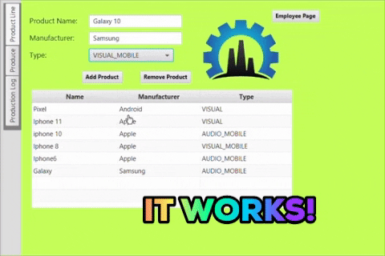

# Production Project
### Author: Breanna Rhodes
This is a GUI project, that also has database.
The database is accessed and can be manipulated to either display or to enter information into the database.
Information is entered into the database using a gui application.
The buttons, text fields, list views, etc have all been given functions to manipulate or display the database.
  

## The First Sprint:
1. **Week 1:** Create a JavaFX project, and share it to a private repository on github with a README.
2. **Week 2:** Add tan pane to display functions, and style using CSS.
3. **Week 3:** Assembly application interface and establish functions for buttons, text fields, etc.
4. **Week 4:** Create/Connect the database.
5. **Week 5:** All manipulations of the database are entered into the controller class, button adds to database.
- [x] First Sprint

## The Second Sprint:
1. **Week 6:** Add an Enum to your project, as well an interface and abstract class.
2. **Week 7:** Use inheritance in project.
3. **Week 8:** Use polymorphism in project.
4. **Week 9:** Use polymorphism and incorporate it into a gif.
5. **Week 10:** Enhance products using encapsulation.
6. **Week 11:** Populate tableview using ArrayList and observable list.
- [x] Second Sprint

## The Third Sprint:
1. **Week 12:** Add a lambda expression to project and put h2 jar file into project file.
2. **Week 13:** Set a database password and read it from a file.
3. **Week 14:** Use recursive methods to assure safety of password.
4. **Week 15:** Quality review and deployment.
- [x] Third Sprint

## Software
- Intellij Ultimate IDE
- Scenebuilder
- H2 Driver

## Acknowledgments

* https://sites.google.com/site/profvanselow/course/cop-3003/oop-project
* https://www.tutorialspoint.com/javafx/javafx_css.htm
* https://docs.oracle.com/javafx/2/api/javafx/scene/doc-files/cssref.html
* https://www.tutorialspoint.com/jdbc/jdbc-insert-records.htm
* http://tutorials.jenkov.com/jdbc/preparedstatement.html
* https://docs.oracle.com/javase/8/javafx/api/javafx/fxml/doc-files/introduction_to_fxml.html#controllers
* http://google.github.io/styleguide/javaguide.html
* https://www.oracle.com/technetwork/java/javase/documentation/index-137868.html
* https://docs.oracle.com/javafx/2/get_started/jfxpub-get_started.htm
* https://www.tutorialspoint.com/jdbc/jdbc-statements.htm
